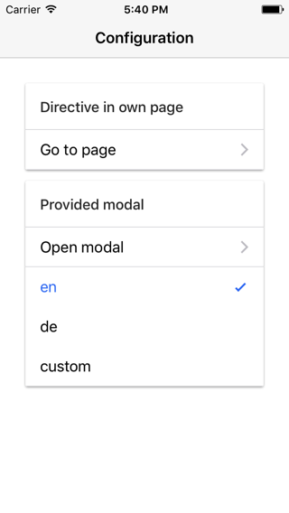
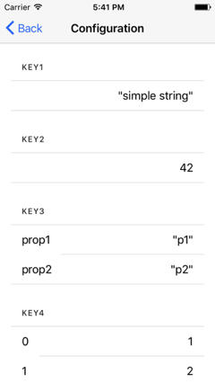
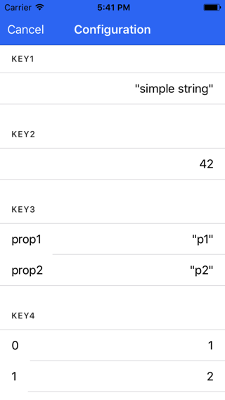

# ionic-configuration-sample

[](https://travis-ci.org/Ritzlgrmft/ionic-configuration-sample)
[](https://david-dm.org/ritzlgrmft/ionic-configuration-sample/master)
[](https://david-dm.org/ritzlgrmft/ionic-configuration-sample/master?type=peer)
[](https://david-dm.org/ritzlgrmft/ionic-configuration-sample/master?type=dev)
[](http://commitizen.github.io/cz-cli/)
[](https://snyk.io/test/github/ritzlgrmft/ionic-configuration-sample)

The configuration sample is a small Ionic app demonstrating the usage of
[ionic-configuration-service](https://github.com/Ritzlgrmft/ionic-configuration-service) and
[ionic-configuration-viewer](https://github.com/Ritzlgrmft/ionic-configuration-viewer).

## Screenshots

| Home Page | Configuration Page | Configuration Modal |
| ---------- | ------------- | ----------- |
|  |  |  |

## Usage

```bash
git clone https://github.com/Ritzlgrmft/ionic-configuration-sample.git
cd ionic-configuration-sample
npm install
ionic serve
```
